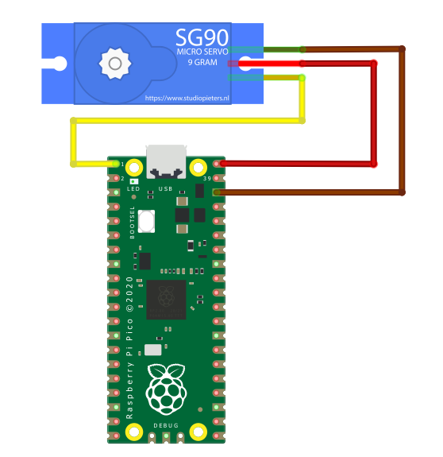

# SG-90
A servo motor SG-90 C/Python Library of Raspberry Pi Pico.



## Example Demo - Python
```python
from machine import Pin
import time
import sg90

# led
led = Pin("LED", Pin.OUT)
led.on()

if __name__ == "__main__":
    sg90.init()
    while True:
        sg90.set_angle(0)
        time.sleep(3)
        sg90.set_angle(90)
        time.sleep(3)
```

## Example Demo - C
In this project, we put `sg90.c` and `sg90.h` into the `/src/` directory.

### main.c
```c
/**
 * Copyright (c) 2020 Raspberry Pi (Trading) Ltd.
 *
 * SPDX-License-Identifier: BSD-3-Clause
 */

#include "pico/stdlib.h"
#include "src/sg90.h"

// Pico W devices use a GPIO on the WIFI chip for the LED,
// so when building for Pico W, CYW43_WL_GPIO_LED_PIN will be defined
#ifdef CYW43_WL_GPIO_LED_PIN
#include "pico/cyw43_arch.h"
#endif

// Led delay times
#ifndef LED_DELAY_MS
#define LED_DELAY_MS 2000
#endif

// Perform initialisation
int pico_led_init(void) {
#if defined(PICO_DEFAULT_LED_PIN)
    // A device like Pico that uses a GPIO for the LED will define PICO_DEFAULT_LED_PIN
    // so we can use normal GPIO functionality to turn the led on and off
    gpio_init(PICO_DEFAULT_LED_PIN);
    gpio_set_dir(PICO_DEFAULT_LED_PIN, GPIO_OUT);
    return PICO_OK;
#elif defined(CYW43_WL_GPIO_LED_PIN)
    // For Pico W devices we need to initialise the driver etc
    return cyw43_arch_init();
#endif
}

// Turn the led on or off
void pico_set_led(bool led_on) {
#if defined(PICO_DEFAULT_LED_PIN)
    // Just set the GPIO on or off
    gpio_put(PICO_DEFAULT_LED_PIN, led_on);
#elif defined(CYW43_WL_GPIO_LED_PIN)
    // Ask the wifi "driver" to set the GPIO on or off
    cyw43_arch_gpio_put(CYW43_WL_GPIO_LED_PIN, led_on);
#endif
}

int main() {
    stdio_init_all();
    int rc = pico_led_init();
    hard_assert(rc == PICO_OK);
    sg90_init();

    while (true) {
        pico_set_led(true);
        sg90_set_angle(90);
        sleep_ms(LED_DELAY_MS);
        
        pico_set_led(false);
        sg90_set_angle(180);
        sleep_ms(LED_DELAY_MS);
    }
}
```

### CMakeLists.txt
You must add `sg90.c` to the `add_executable()` and include `hardware_pwm` in the  `target_link_libraries()` on your `CmakeLists.txt` file.
